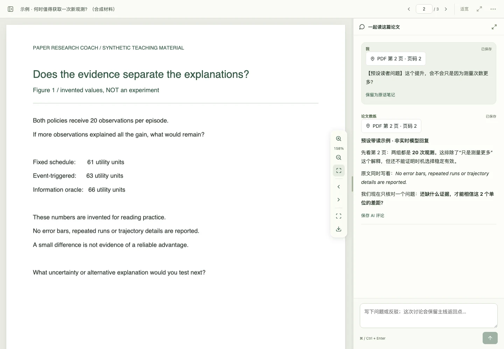
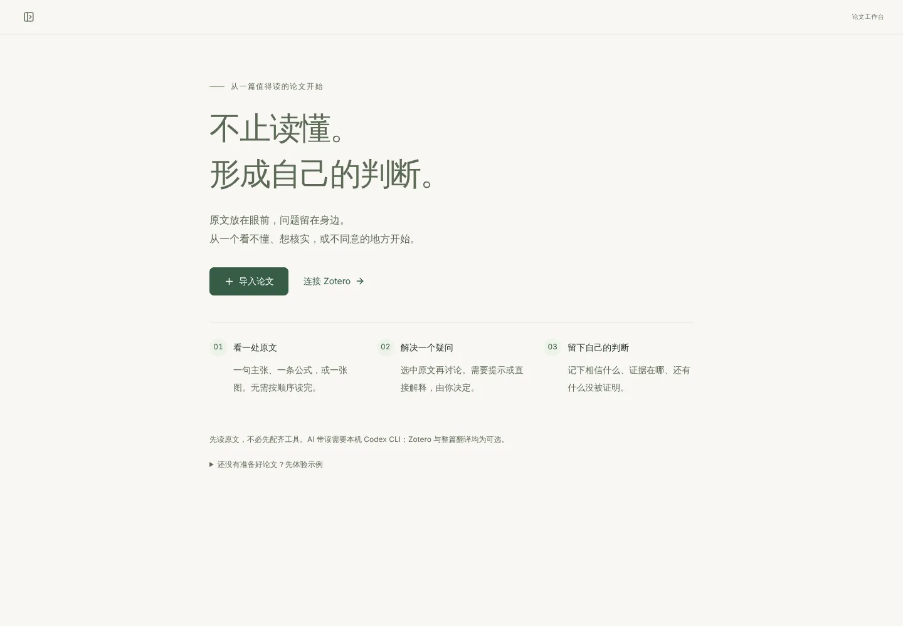
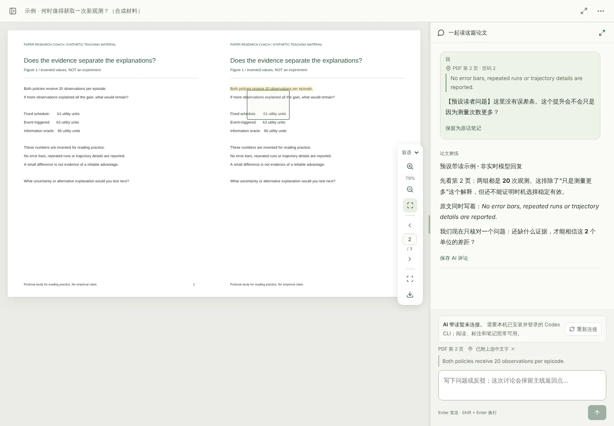

<div align="center">


# Paper Research Coach

**Read beyond the summary. Make the judgment your own.**

A local workspace that keeps **the paper, your question and your thinking** together, and a portable reading-coach Skill for Claude Code, Codex and Pi.<br>
It does not write you another summary. It checks the evidence with you, one passage at a time, and leaves the judgment in your hands.

[](https://github.com/ooooooomygosh/paper-research-coach/actions/workflows/verify.yml)
[](https://github.com/ooooooomygosh/paper-research-coach/releases)
[](docs/QUICKSTART.md)
[](#quick-start)
[](LICENSE)

[简体中文](README.md) · **English** · [Quick start](docs/QUICKSTART.md) · [Reading method](docs/METHOD.en.md) · [Workbench guide](docs/WORKBENCH.en.md) · [Design](docs/DESIGN.md) · [Contributing](CONTRIBUTING.md)

</div>

<br>

<picture>
  <source media="(prefers-color-scheme: dark)" srcset="docs/images/reading-dark.webp">
  
</picture>

<p align="center"><sub>Actual UI, following your light / dark theme · synthetic paper and a labelled scripted dialogue, not live-model output; no model was connected · <a href="docs/SHOWCASE.md">Reproduce</a></sub></p>

> [!NOTE]
> **Preview software, not a proven learning intervention.** Pinch zoom and translated-PDF annotations require `2.0.0rc9` or newer; `prc-demo` is available from rc6. If the packages for a version are not in Releases yet, follow the [source quick start](docs/QUICKSTART.md).

## How it differs from “summarise this paper”

|  | Typical AI paper assistant | Paper Research Coach |
|---|---|---|
| **Each turn gives you** | A page-long summary | One passage, one question, at most one thinking task |
| **Who judges** | The AI states a conclusion | A provisional judgment, checked against the source; ask for a hint, a direct explanation, or a challenge |
| **Your thoughts** | Lost in the chat | Saved verbatim, apart from AI comments, with a page anchor |
| **Evidence** | Hard to trace back | Every message and note returns to its place in the PDF; anchors from an older PDF version are flagged |
| **What remains** | Another summary | A provisional judgment, open questions and the smallest useful test |
| **Your data** | Uploaded | PDFs and notes stay local; only the turns you send reach the configured model |

## Why read this way

The habits students use most — rereading, highlighting, summarising — are among the least effective; familiarity with material in front of you easily passes for understanding, and a fluent AI summary makes the illusion stronger. This method spends its effort on getting **you** to predict, check, explain and recall, drawing on three kinds of sources:

| Source | Representatives | Practices it brings |
|---|---|---|
| Researchers’ experience | Harry Shum & Gang Hua’s “three levels, four stages, ten questions”, Shuyi Wang (relaying Peter Carr), Keshav, Mu Li, Nielsen, Hamming | Don’t read linearly: abstract → conclusion → figures → introduction → discussion, methods last, stop any time; skim / careful / study; ten questions as a coverage check; end with a next research step |
| Scientific method | Platt’s *Strong Inference*, Chamberlin’s multiple hypotheses, Popper, Toulmin | For a key claim, list alternatives and seek discriminating evidence and strong simple baselines |
| Learning science | Cognitive apprenticeship, scaffolding, cognitive load, retrieval practice, the generation effect, self-explanation | One move per turn; predict before looking; fade help by ability; keep your own words; recall with the paper closed |

Each paper should push you up one level: from **passive** reading (what it says) to **active** (what it is for), **critical** (does it hold up) and **creative** (what can I do with it). The pocket version: after each paper, be able to say **what judgment it changes, why you believe it, and how it changes your next step**.

👉 The seven principles, where the eight-step route comes from, the theory behind each practice and a reading list are in **[The reading method](docs/METHOD.en.md)**. These sources motivate the design; they do not show that this tool improves learning.

## Highlights

<table>
<tr>
<td width="33%" valign="top">

**💬 Talk about the source**<br>
Select a sentence and choose “discuss”; the quote travels with your question and stays in the conversation. Enter sends, Shift + Enter breaks a line.

</td>
<td width="33%" valign="top">

**🖍️ Marks are not opinions**<br>
A highlight is the paper's words, a note is yours. Kept marks are never discussed as your view; add a thought at the same place at any time.

</td>
<td width="33%" valign="top">

**🧭 Detour and come back**<br>
The eight-step route is an evidence map, not a syllabus. After a local question, the return point is still where you left it.

</td>
</tr>
<tr>
<td valign="top">

**🌗 Built for focus**<br>
The library is collapsed while reading. Immersive mode, dark theme, pinch zoom, fit-width and position recovery.

</td>
<td valign="top">

**🌐 Non-native friendly**<br>
Separates language barriers from conceptual gaps; no whole-paper translation required. In optional bilingual PDFs, marks are kept per rendition.

</td>
<td valign="top">

**🔌 Two ways, one method**<br>
Install the Skill for coaching in your agent, or run the local workbench to read and discuss side by side. Zotero, translation and exports are optional.

</td>
</tr>
</table>

<table>
<tr>
<td width="50%"></td>
<td width="50%"></td>
</tr>
<tr>
<td align="center"><sub>First run: import one PDF and start</sub></td>
<td align="center"><sub>Marks kept per rendition in the side-by-side view (both columns are synthetic English, a layout test)</sub></td>
</tr>
</table>

## Quick start

### Option 1: Claude Code (recommended)

```text
/plugin marketplace add ooooooomygosh/paper-research-coach
/plugin install paper-research-coach@paper-research-coach
```

Attach a paper and ask: **“Guide my reading of this paper. Start with the authors' key observation.”** It uses your host's existing model; no Python, Node.js, Zotero or separate API key from this project is needed.

### Option 2: Codex, Pi and other hosts

```bash
npx skills add ooooooomygosh/paper-research-coach
```

<details>
<summary>Without npx: install the Skill by hand</summary>

Download `paper-research-coach-skill-*.zip` from [Releases](https://github.com/ooooooomygosh/paper-research-coach/releases) and extract the **complete folder** into your host's skill directory:

| Host | User-level directory |
|---|---|
| Codex | `~/.agents/skills/paper-research-coach/` |
| Claude Code | `~/.claude/skills/paper-research-coach/` |
| Pi | `~/.pi/agent/skills/paper-research-coach/` |

Keep `references` and `assets`, not just `SKILL.md`. Format compatibility is not a claim that every host and model has been tested.

</details>

### Option 3: the local workbench

Requires **Python 3.10+**. Download the `.whl` from [Releases](https://github.com/ooooooomygosh/paper-research-coach/releases), then in the download directory:

```bash
python3 -m venv .venv && source .venv/bin/activate
python -m pip install "./paper_research_coach-<version>-py3-none-any.whl"   # use the actual filename
prc open        # open your library
prc-demo        # or try a three-page synthetic paper first; your library is untouched
```

Then: **import one PDF → select one passage → ask your current question.** The wheel already includes the interface; Node.js is only for source development. The workbench's AI conversation uses a locally authenticated Codex CLI; reading, marking and notes work without it. Windows, source installs and troubleshooting: [Quick start](docs/QUICKSTART.md).

## What a turn looks like

> **Reader:** Could this gain just come from taking more measurements?
>
> **Coach:** First check whether Figure 1 matches the two measurement budgets. Would that explanation still hold? A direct explanation is fine too.

<sub>An illustrative exchange, not a live-model result. Solving one local question or deciding not to pursue a paper are valid outcomes too.</sub>

| Your question | The coach's job |
|---|---|
| What did the authors actually notice? | Separate the distinctive observation from background and the proposed method. |
| Does this result support the claim? | Inspect the evidence, matched budgets, alternative explanations and limits. |
| Is my difficulty language or the concept? | Separate translation, prerequisite knowledge and the paper's argument; preserve qualifiers. |
| Where did my thought come from? | Keep your words apart from AI commentary, with a return path to the source. |
| What changes in my research next? | Record a provisional judgment, an open question or the smallest useful test. |

## Privacy and limits

- Papers and reading records are stored locally and the service binds to loopback. **Local storage does not mean offline AI**: using the coach or translation sends relevant content to the configured model provider.
- Zotero writes require your authorization. Never share the launch link, which carries an access credential. See [Data and access boundaries](docs/SECURITY.md).
- There is no human learning-effect claim, no full Safari / iPad / Pencil certification and no guaranteed OCR for scanned PDFs. Zotero items with several attachments currently use the first PDF. See [Testing](docs/TESTING.md) and [Review](docs/FINAL-REVIEW.md).

## FAQ

<details>
<summary><b>Do I need a separate paid API key?</b></summary>

The Skill uses the model your host (Claude Code, Codex, Pi) is already configured with. The workbench's coach currently runs through a locally signed-in Codex CLI; reading, marking, notes and exports need no model at all.

</details>

<details>
<summary><b>Does it grade me or decide that I have “mastered” something?</b></summary>

No. Only if you enable recording of answers and feedback does it store one observation per ability, quoting your own words and the criterion used. Clicks, reading an AI explanation or completed steps are never treated as evidence of mastery.

</details>

<details>
<summary><b>Does it work with Zotero or Obsidian?</b></summary>

Yes, optionally. Zotero sync needs Zotero 10+ with the local API enabled and your authorization. OneDrive / Obsidian folders, bilingual translation, review and talk exports are covered in the [Workbench guide](docs/WORKBENCH.en.md).

</details>

<details>
<summary><b>What about scanned PDFs?</b></summary>

Automatic OCR is not guaranteed. You can mark a region and discuss its image with the coach; an empty text layer is not an empty page.

</details>

## Contribute

Start with [CONTRIBUTING.md](CONTRIBUTING.md). Describe the reading task that was interrupted, not just the control you would like to add. Use synthetic reproduction material; do not submit private PDFs, databases, credentials or conversations.

If this project helps you read, a star ⭐ helps other careful readers find it.

<a href="https://star-history.com/#ooooooomygosh/paper-research-coach&Date">
  <picture>
    <source media="(prefers-color-scheme: dark)" srcset="https://api.star-history.com/svg?repos=ooooooomygosh/paper-research-coach&type=Date&theme=dark">
    
  </picture>
</a>

## License and credits

Original code and documentation: [MIT](LICENSE). [Reading-method sources](docs/SOURCES.md) and [translation-component licensing](docs/THIRD_PARTY_TRANSLATION.md) retain their respective boundaries.
